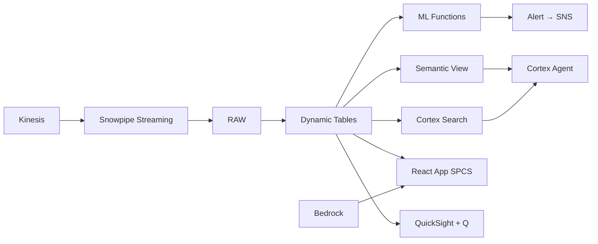

# Digital Islamic Banking Intelligence

Real-time transaction monitoring for Malaysia's digital Islamic banks — Snowpipe Streaming ingests millions of transactions, ML.ANOMALY_DETECTION catches suspicious activity, and Cortex Complete generates personalized Shariah-compliant offers.

## Architecture

Bank Negara Malaysia licensed 5 digital banks in 2022, creating a new wave of Shariah-compliant fintech innovation. A leading digital Islamic bank processes 2 million transactions monthly, but legacy fraud systems flag too late and personalization requires manual campaign builds. With Snowpipe Streaming for real-time ingestion and ML.ANOMALY_DETECTION for instant scoring, suspicious transactions are caught in minutes — while Cortex Complete generates personalized Shariah-compliant offers that drive 2x conversion.



## Snowflake Capabilities

| Capability | Implementation |
|-----------|---------------|
| Dynamic Tables | TRANSACTION_METRICS / FRAUD_ALERTS_LIVE / CUSTOMER_SEGMENTS / PRODUCT_PERFORMANCE |
| ML Functions | ML.ANOMALY_DETECTION + ML.CLASSIFICATION |
| Cortex AI | COMPLETE, AI_CLASSIFY, SUMMARIZE |
| Cortex Search | 20000 documents indexed |
| Cortex Agent | DIGITAL_BANKING_AGENT |
| Semantic View | DIGITAL_BANKING_ANALYTICS |
| React App (SPCS) | 5 tabs + DemoGuide |


## AWS Services

| Service | Role in Demo |
|---------|-------------|
| Amazon Kinesis | Stream real-time transaction events from banking core |
| Amazon SNS | Push fraud alerts to investigation teams in real time |
| Amazon SES | Send personalized Shariah-compliant offers to customers |
| Amazon Bedrock (Claude) | Generate personalized product recommendations and fraud narratives |
| Amazon QuickSight + Q | Digital banking operations dashboard with NL queries |


## Personas

| Persona | Role | Key Questions |
|---------|------|---------------|
| **Encik Hafiz bin Abdullah** | Chief Digital Officer | "What's our monthly transaction volume and growth rate?" "How many suspicious transactions were flagged today?" |
| **Priya Devi a/p Raman** | Anti-Fraud Analyst | "Which accounts have velocity anomalies today?" "Show me the transaction pattern for flagged account ACC-77201." |


## Data

| Table | Rows | Description |
|-------|------|-------------|
| TRANSACTIONS | 2,000,000 | Monthly Islamic banking transactions (transfers, payments, financing) |
| ACCOUNTS | 100,000 | Digital Islamic bank customer accounts |
| ALERTS | 5,000 | Fraud and AML alerts generated by ML models |
| PRODUCTS | 50 | Shariah-compliant digital banking products (savings, financing, investment) |
| CUSTOMER_FEEDBACK | 20,000 | App store reviews, in-app feedback, and NPS responses |


## Build Instructions

### Prerequisites
- Snowflake account with ACCOUNTADMIN access
- Cortex AI enabled (ML Functions, Search, Agent)
- Warehouse: DIGITAL_WH (Medium)
- AWS CLI with access (us-west-2)

### Deployment

```bash
snowsql -f snowflake/00_setup.sql
snowsql -f snowflake/01_marketplace_install.sql
snowsql -f snowflake/02_raw_tables.sql
snowsql -f snowflake/03_staging.sql
snowsql -f snowflake/04_dynamic_tables.sql
snowsql -f snowflake/05_search.sql
snowsql -f snowflake/06_ml_models.sql
snowsql -f snowflake/07_semantic_view.sql
snowsql -f snowflake/08_agent.sql
```

### React App (SPCS)
```bash
cd app && npm ci && npm run build
docker build -t aws-malaysia-islamic-finance-digital-app .
docker push bdiqc8sm-default.registry.snowflakecomputing.com/islamic_digital_banking/app/aws_malaysia_islamic_finance_digital/app:latest
```

### Demo Mode
Open the app URL with `?demo=true` for presenter view.

## Build Modes

### Snowflake Only
Run scripts 00-08 (skip AWS-specific integration). Uses:
- **Snowpipe Streaming SDK** instead of Amazon Kinesis
- **Alerts + Notification Integration** instead of Amazon SNS
- **Notification Integration (email)** instead of Amazon SES
- **Cortex Complete** instead of Amazon Bedrock (Claude)
- **Snowflake Intelligence (Cortex Analyst)** instead of Amazon QuickSight + Q

### Full AWS + Snowflake
Run all scripts including AWS integration. Deploy QuickSight dashboard from `quicksight/`.

## Business Impact

Industry research and Snowflake customer outcomes:
- **BNM licensed 5 digital banks in 2022 targeting 9.6M unbanked/underserved Malaysians** — [Bank Negara Malaysia](https://www.bnm.gov.my/financial-stability)
- **Real-time fraud detection reduces financial crime losses by 50-70% vs batch processing** — [McKinsey Banking](https://www.mckinsey.com/industries/financial-services/our-insights)
- **AI personalization in banking drives 20-30% improvement in product conversion rates** — [Accenture Banking](https://www.accenture.com/us-en/industries/banking)
- **Malaysia's digital payment transactions reached 9.4 billion in 2023, growing 28% YoY** — [BNM Payment Statistics](https://www.bnm.gov.my/payment-statistics)
- **Western Union** (Snowflake customer): processes 1B+ cross-border transactions on Snowflake with real-time compliance monitoring across 200+ countries -- [snowflake.com/customers/western-union](https://www.snowflake.com/en/customers/all-customers/case-study/western-union/)

## Key Demo Numbers

- **2M transactions** processed monthly through digital Islamic bank
- **RM 890M** monthly transaction volume
- **127 suspicious** transactions flagged by ML.ANOMALY_DETECTION
- **99.2%** straight-through processing rate
- **4.2 stars** average app rating from 20,000 reviews


## License

Apache 2.0 — See [LICENSE](LICENSE) for details.

This is a personal demo project and is not an official Snowflake offering. It comes with no support or warranty.