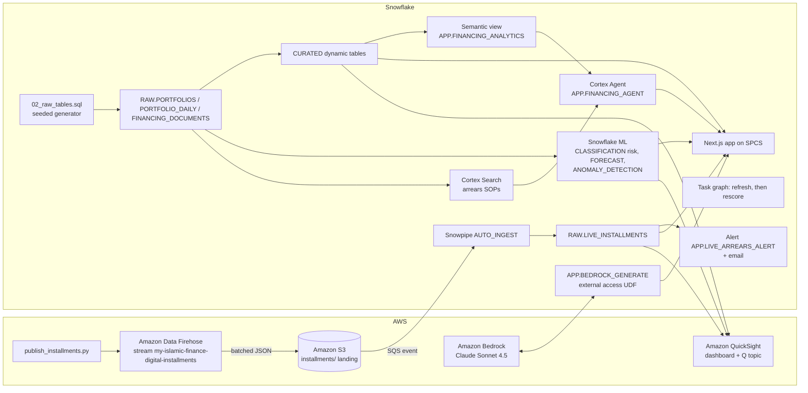

# Malaysia Digital Islamic Bank Financing Collections - Arrears and Escalation Operations

End-to-end collections operations for **40 financing portfolios at a fictional Malaysian digital Islamic bank (app-only customers) across 5 cities** (Kuala Lumpur, Johor Bahru, George Town, Kota Kinabalu, Kuching) using Snowflake, optionally with AWS: from a live missed installment to a 7-day arrears escalation risk score, an alert email and an AI action memo for the collections team.

## Architecture

A collections pipeline built on **Snowflake** (Dynamic Tables, Snowflake ML, Cortex Search, Cortex Agent, Cortex AI_COMPLETE, SPCS) and, in the full build, **AWS** (Amazon Data Firehose, S3, Bedrock Claude, QuickSight + Amazon Q). Installment events land in `RAW.LIVE_INSTALLMENTS`. Dynamic tables curate 90 days of portfolio-day history: installments due, arrears cases, escalations to restructuring review, customer-contact SLA breaches, on-time collection rate and customer account review compliance. Snowflake ML scores 7-day arrears escalation risk per portfolio, forecasts bank-wide arrears volume and flags auto-debit rejection rate anomalies. A Cortex Agent answers questions with SOP citations, and an LLM drafts the collections action memo.

The portfolios cover five common Islamic financing structures: tawarruq (a commodity-based sale arrangement, paid in installments) for personal financing, murabahah (a sale at cost plus a disclosed margin) for SMEs, musharakah mutanaqisah (a diminishing partnership) for homes, ijarah (a lease) for equipment, and mudarabah (a profit-sharing arrangement) for working capital. The demo models collections operations only. It does not make religious or regulatory rulings, and its SOPs are synthetic.

Interactive diagrams (hover for object names): [Snowflake only](docs/architecture-snowflake.html) | [AWS + Snowflake](docs/architecture-aws.html). The app shows both on its Architecture & Data tab, the current build first. Regenerate them with `python3 docs/build_architecture.py`.


```mermaid
flowchart LR
    subgraph AWS
      SIM[publish_installments.py] --> FH[Amazon Data Firehose<br/>stream my-islamic-finance-digital-installments]
      FH -->|batched JSON| S3[(Amazon S3<br/>installments/ landing)]
      BR[Amazon Bedrock<br/>Claude Sonnet 4.5]
      QS[Amazon QuickSight<br/>dashboard + Q topic]
    end
    subgraph Snowflake
      S3 -->|SQS event| PIPE[Snowpipe AUTO_INGEST] --> LIVE[RAW.LIVE_INSTALLMENTS]
      GEN[02_raw_tables.sql<br/>seeded generator] --> RAW[RAW.PORTFOLIOS / PORTFOLIO_DAILY / FINANCING_DOCUMENTS]
      RAW --> DT[CURATED dynamic tables]
      RAW --> ML[Snowflake ML<br/>CLASSIFICATION risk, FORECAST,<br/>ANOMALY_DETECTION]
      DT --> SV[Semantic view<br/>APP.FINANCING_ANALYTICS]
      RAW --> CS[Cortex Search<br/>arrears SOPs]
      SV --> AG[Cortex Agent<br/>APP.FINANCING_AGENT]
      CS --> AG
      LIVE --> AL[Alert APP.LIVE_ARREARS_ALERT<br/>+ email]
      UDF[APP.BEDROCK_GENERATE<br/>external access UDF]
      TK[Task graph: refresh, then rescore]
      APP[Next.js app on SPCS]
    end
    BR <--> UDF
    DT --> APP
    ML --> APP
    LIVE --> APP
    AG --> APP
    UDF --> APP
    DT --> QS
    ML --> QS
    LIVE --> QS
```

The Snowflake-only build drops the AWS subgraph: `APP.SIMULATE_INSTALLMENTS` writes to `RAW.LIVE_INSTALLMENTS`, and the app calls Cortex `AI_COMPLETE` instead of the Bedrock UDF.

## Snowflake Capabilities

| Capability | Implementation |
|-----------|---------------|
| Dynamic Tables | `CURATED.KPI_SUMMARY`, `PERFORMANCE_SUMMARY`, `ARREARS_SUMMARY`, `TREND_ANALYSIS` from the RAW tables |
| Snowflake ML | CLASSIFICATION 7-day arrears escalation risk (`ML.ESCALATION_RISK_SCORES`), 14-day arrears-volume FORECAST, auto-debit rejection rate ANOMALY_DETECTION |
| Cortex Search | 14 synthetic arrears-handling SOPs (one per financing product and arrears reason) in `SEARCH.ARREARS_SOP_SEARCH` |
| Semantic View | `APP.FINANCING_ANALYTICS` over portfolios, arrears reasons, daily totals and risk |
| Cortex Agent | `APP.FINANCING_AGENT`: Cortex Analyst over the semantic view plus Cortex Search for SOP citations |
| Cortex AI | `AI_COMPLETE('claude-sonnet-4-5')` for grounded answers, and for the action memo in the Snowflake-only build |
| Alerts + Tasks | `APP.LIVE_ARREARS_ALERT` logs MISSED installments and sends email; task graph `TASK_REFRESH_CURATED`, then `TASK_RESCORE_RISK` |
| Snowpark Container Services | Next.js app `APP.MY_ISLAMIC_FINANCE_DIGITAL_APP` with 6 tabs: Executive Cockpit, Predictive, Controls, Live Installments, Ask AI, Architecture & Data |
| Snowpipe | `RAW.LIVE_INSTALLMENTS_PIPE` AUTO_INGEST from S3 (AWS build only) |

## AWS Services

Used only in the AWS + Snowflake build.

| Service | Role in Demo |
|---------|-------------|
| Amazon Data Firehose | Direct PUT stream `my-islamic-finance-digital-installments` receives simulated installment events and writes batches to S3 |
| Amazon S3 | Landing bucket (`installments/`). An event notification goes to the Snowpipe SQS queue |
| Amazon Bedrock | Claude Sonnet 4.5 writes the action memo, called from Snowflake through an external-access UDF |
| Amazon QuickSight | DIRECT_QUERY executive dashboard over Snowflake (daily arrears cases, escalations by portfolio, escalation risk) |
| Amazon Q | Natural-language questions over the QuickSight topic `my-islamic-finance-digital-topic` |
| AWS IAM | Least-privilege roles for S3, Firehose and Bedrock |

## Personas

These personas are fictional.

| Persona | Role | Key Questions |
|---------|------|---------------|
| **Nurul Aina binti Ismail** | Head of Collections | "What is our on-time collection rate?" "Which arrears reasons turn into escalations to restructuring review?" |
| **Daniel Lim Wei Jie** | Collections Analyst | "Which portfolios are high risk this week, and which SOP applies?" |

## Data

All data is synthetic and seeded, so every rebuild reproduces it. The bank, portfolios and names are fictional; the cities are real Malaysian cities used as regions.

| Table | Rows | Description |
|-------|------|-------------|
| RAW.PORTFOLIOS | 40 | Financing portfolios across 5 cities and 5 products (Tawarruq personal, SME murabahah, Musharakah mutanaqisah home, Ijarah equipment, Mudarabah working capital), with customer risk grade |
| RAW.PORTFOLIO_DAILY | 3,600 | Daily portfolio observations over 90 days: installments due, value (MYR), arrears cases, escalations, contact SLA breaches, arrears reason, customer account reviews, auto-debit rejection rate and average days past due |
| RAW.FINANCING_DOCUMENTS | 40 | Required, on-file and pending financing file documents per portfolio |
| SEARCH.ARREARS_DOCS | 14 | Synthetic arrears-handling SOPs indexed for Cortex Search |
| RAW.LIVE_INSTALLMENTS | Grows during the demo | Live installment events from Firehose (AWS build) or `APP.SIMULATE_INSTALLMENTS` (Snowflake-only build) |
| ML.ESCALATION_RISK_SCORES | 40 | 7-day escalation probability and risk band per portfolio |

## Build Instructions

### Prerequisites
- Snowflake account with ACCOUNTADMIN access, and Cortex AI enabled (AI_COMPLETE, Search, Agent).
- An X-Small warehouse with auto-suspend at or below 120 s, and an existing SPCS compute pool.
- Python 3.11+, `snowflake-connector-python`, Node.js 22+, Docker and the `snow` CLI.
- App image: run `snow spcs image-registry login`, then build and push `my-islamic-finance-digital-app:v1` to the database's `APP.IMAGES` repository (see the header of `snowflake/07_deploy_app.sql`).
- AWS build only: `boto3`, AWS credentials for the target account (us-west-2) with Bedrock access, and QuickSight Enterprise.

### SPCS App
```
<DATABASE>.APP.MY_ISLAMIC_FINANCE_DIGITAL_APP
```

### Tests
```bash
python -m pytest aws snowflake quicksight
```

For a local run, put `SNOWFLAKE_ACCOUNT`, `SNOWFLAKE_USER`, `SNOWFLAKE_DATABASE`, `SNOWFLAKE_WAREHOUSE`, `SNOWFLAKE_AUTHENTICATOR=PROGRAMMATIC_ACCESS_TOKEN`, `SNOWFLAKE_TOKEN` and `DEMO_PLATFORM` in the environment, then run `npm --prefix app run build && npm --prefix app start`.

## Build Modes

Both modes share the same core. They differ in three places, and the app's `DEMO_PLATFORM` setting (in its SPCS spec) switches the memo provider and the Live Installments tab.

| Layer | Snowflake Only | Full AWS + Snowflake |
|---|---|---|
| Live installments | `CALL APP.SIMULATE_INSTALLMENTS(n)` inserts simulated installment events into `RAW.LIVE_INSTALLMENTS`. This simulates an installment feed; it is not Snowpipe Streaming | `aws/publish_installments.py` to Amazon Data Firehose, then S3, SQS and Snowpipe AUTO_INGEST |
| Action memo | Cortex `AI_COMPLETE('claude-sonnet-4-5')` | Amazon Bedrock Claude Sonnet 4.5 through `APP.BEDROCK_GENERATE` |
| BI and natural-language questions | The SPCS app is the dashboard; questions go to the Cortex Agent | Also a QuickSight dashboard and an Amazon Q topic |
| App setting | `DEMO_PLATFORM: snowflake` | `DEMO_PLATFORM: aws` |

### Snowflake Only

```bash
# 1. Core data and dynamic tables (guarded: new isolated database only)
python snowflake/run_core.py --database MALAYSIA_ISLAMIC_FINANCE_DIGITAL_SNOWFLAKE --warehouse <XS_WAREHOUSE> --connection <CONNECTION> --apply
# 2. Native installment feed, ML, search, semantic view, agent, alert and task graph
python snowflake/run_intelligence.py --database MALAYSIA_ISLAMIC_FINANCE_DIGITAL_SNOWFLAKE --platform snowflake --warehouse <XS_WAREHOUSE> --connection <CONNECTION> --alert-email you@example.com
# 3. App on SPCS with DEMO_PLATFORM=snowflake (push the image first)
python snowflake/run_intelligence.py --database MALAYSIA_ISLAMIC_FINANCE_DIGITAL_SNOWFLAKE --platform snowflake --warehouse <XS_WAREHOUSE> --connection <CONNECTION> --alert-email you@example.com --files 07_deploy_app.sql --compute-pool <COMPUTE_POOL>
```

During the demo:
- Run `CALL APP.SIMULATE_INSTALLMENTS(20)` to add live installment events. For a continuous feed, run `ALTER TASK APP.TASK_SIMULATE_INSTALLMENTS RESUME`, and `SUSPEND` it afterwards.
- Run `EXECUTE ALERT APP.LIVE_ARREARS_ALERT` to raise the alert email.
- Run `EXECUTE TASK APP.TASK_REFRESH_CURATED` to refresh the curated tables and rescore escalation risk.

Afterwards, drop the database or run `ALTER SERVICE APP.MY_ISLAMIC_FINANCE_DIGITAL_APP SUSPEND`.

### Full AWS + Snowflake

```bash
# 1. Core data and dynamic tables (guarded: new isolated database only)
python snowflake/run_core.py --database MALAYSIA_ISLAMIC_FINANCE_DIGITAL_AWS --warehouse <XS_WAREHOUSE> --connection <CONNECTION> --apply
# 2. AWS ingestion and Bedrock (dry run first, then --apply)
python aws/setup_aws.py --database MALAYSIA_ISLAMIC_FINANCE_DIGITAL_AWS --account <AWS_ACCOUNT_ID> --connection <CONNECTION> --apply
# 3. ML, search, semantic view, agent, alert and task graph
python snowflake/run_intelligence.py --database MALAYSIA_ISLAMIC_FINANCE_DIGITAL_AWS --platform aws --warehouse <XS_WAREHOUSE> --connection <CONNECTION> --alert-email you@example.com
# 4. App on SPCS with DEMO_PLATFORM=aws (push the image first)
python snowflake/run_intelligence.py --database MALAYSIA_ISLAMIC_FINANCE_DIGITAL_AWS --platform aws --warehouse <XS_WAREHOUSE> --connection <CONNECTION> --alert-email you@example.com --files 07_deploy_app.sql --compute-pool <COMPUTE_POOL>
# 5. QuickSight dashboard and Q topic (needs an existing Snowflake data source)
python quicksight/build_dashboards.py --database MALAYSIA_ISLAMIC_FINANCE_DIGITAL_AWS --account <AWS_ACCOUNT_ID> --principal-arn <QUICKSIGHT_USER_ARN> --data-source-arn <DATA_SOURCE_ARN> --prefix my-islamic-finance-digital --apply --update --with-topic
```

QuickSight objects must be shared with the QuickSight user who signs in (`--principal-arn`); otherwise the console shows nothing.

During the demo:
- Run `python aws/publish_installments.py --count 20` to send live installment events. Firehose buffers for up to 60 seconds before writing to S3.
- Run `EXECUTE ALERT APP.LIVE_ARREARS_ALERT` to raise the alert email.
- Run `EXECUTE TASK APP.TASK_REFRESH_CURATED` to refresh the curated tables and rescore escalation risk.

Afterwards, `python aws/teardown_aws.py --database MALAYSIA_ISLAMIC_FINANCE_DIGITAL_AWS --account <AWS_ACCOUNT_ID> --connection <CONNECTION> --apply` removes the AWS resources and the account-level Bedrock external-access and S3 storage integrations. It leaves the email integration `MY_ISLAMIC_FINANCE_DIGITAL_EMAIL_INT`, which the Snowflake-only build also uses.

## Business Impact

Snowflake customer outcomes:
- **Saxo Bank** (Snowflake customer): "Banking on Big Data: Snowflake Enables Saxo Bank to Grow in Size and Agility" -- [Snowflake customer story: Saxo Bank](https://www.snowflake.com/en/customers/all-customers/case-study/saxo-bank/)

## Key Demo Numbers

These figures are synthetic and come from the seeded demo data. Forecast and anomaly figures can shift slightly with the build day.

- **40 portfolios** across 5 Malaysian cities and 5 financing products, 3,600 portfolio-days over 90 days; **763,283 installments due** worth MYR 974 M
- **On-time collection rate 99.92%**: **598 arrears cases**, of which **214** were escalated to restructuring review (escalation rate 35.8%); **106 contact SLA breaches**
- **Auto-debit insufficient balance** produces the most escalations (84 of 202 cases); the 16 payment channel disruption cases always resolve without escalation
- **Escalation risk model** out-of-time holdout: precision 0.34, recall 0.32 at a 0.5 threshold, against a 0.22 base rate. Nine portfolios are high risk; the top portfolio is PRT-0034, at 91.4%
- **14-day arrears forecast** with prediction intervals; **33 of 640** portfolio-days flagged as auto-debit rejection rate anomalies
- **Account review compliance 77.1%**, financing file coverage 66.7%, with 15 documents pending
- **14 SOPs** indexed for Cortex Search and cited by ID in agent answers

## License

Apache 2.0 — See [LICENSE](LICENSE) for details.

This is a personal demo project and is not an official Snowflake offering. It comes with no support or warranty. Industry metrics cited are from publicly available third-party sources and Snowflake customer stories; they represent reported outcomes and are not guarantees of results. The demo does not provide Shariah, legal or regulatory advice.
